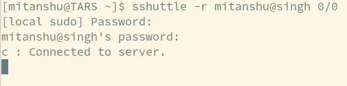

---
# 1. Basic Identification
title: "Browse Intranet from Home"
subtitle: "**When you need to get forms after leaving abrubtly**"
author: "_Mitanshu Sukhwani_"
date: "`2025-06-07`"
lang: en
mainfont: 'Helvetica'

# 2. Metadata / SEO
description: "Guide to securely access the IISER Tirupati intranet from home using Tailscale VPN and sshuttle. Works with a campus-connected workstation and a Linux/Mac device with sudo access. Quick setup for remote intranet browsing."
keywords: "IISER Tirupati, intranet, remote access, Tailscale, sshuttle, VPN"
---

### For IISER Tirupati Intranet, should work elsewhere with little modifications

# Requirements:

1. Tailscale VPN logged in on the already running workstation at campus.

2. Linux/MacOS device with sudo rights.

3. Might work in Windows, however its way too complicated and out of the scope of this tutorial.

# Method

1. If not already done, install and setup [Tailscale](https://tailscale.com/download) on campus pc.

1. [Verify](https://login.tailscale.com/admin/machines) that you are logged into Tailscale and can SSH your account on the `lab-workstation` from a device you will carry back home.

1. Open a terminal and issue:

   ```bash
   ssh <username>@<lab-workstation>
   ```

   to verify access

1. Open a new terminal window (in local machine) and install [sshuttle](https://github.com/sshuttle/sshuttle) using:

   ```bash
   pip install sshuttle
   ```

1. Issue command (on local machine):

   ```bash
   sshuttle --remote <username>@<lab-workstation> 0.0.0.0/0
   ```

   and leave the terminal window alone.

1. You will be first asked to enter your **local** _sudo_ password, and then your ssh password for the lab-workstation. After success, it should display



6. This will route all the intranet traffic to your laptop, visit `172.27.1.51` to confirm.

# For more information, see [sshuttle Documentation](https://sshuttle.readthedocs.io/en/stable/index.html).

## For Windows, [see](https://sshuttle.readthedocs.io/en/stable/windows.html).
