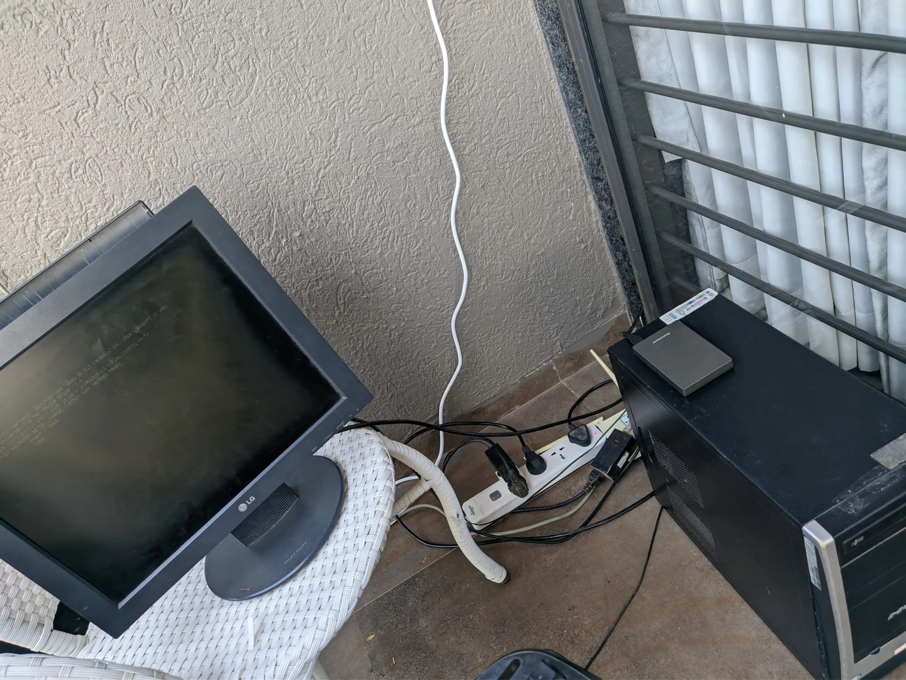
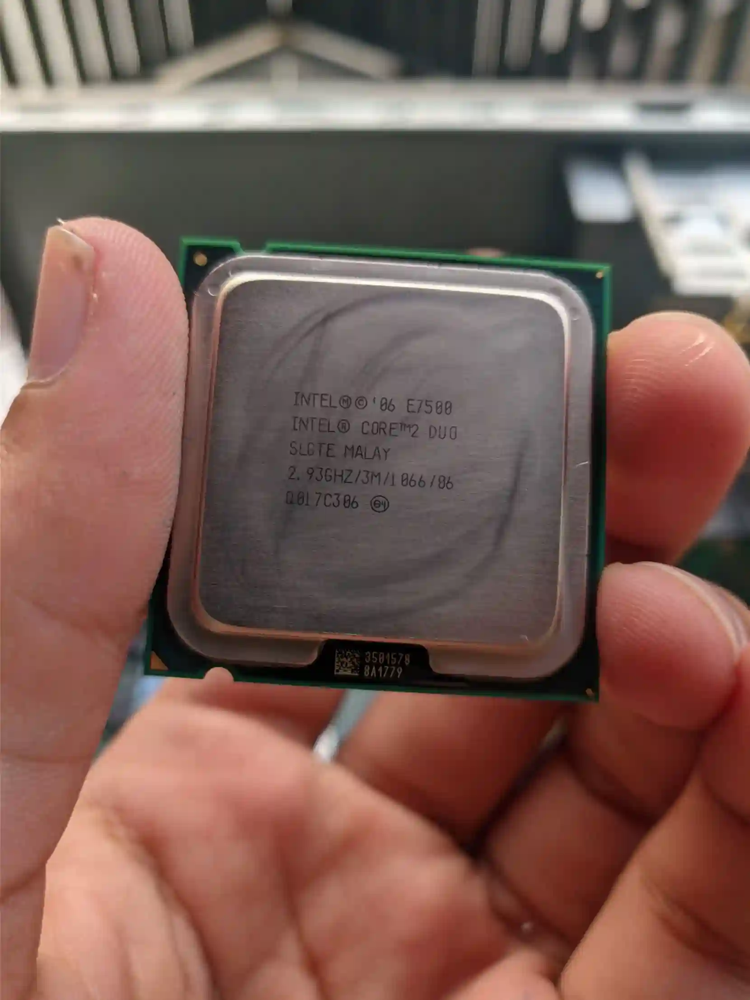
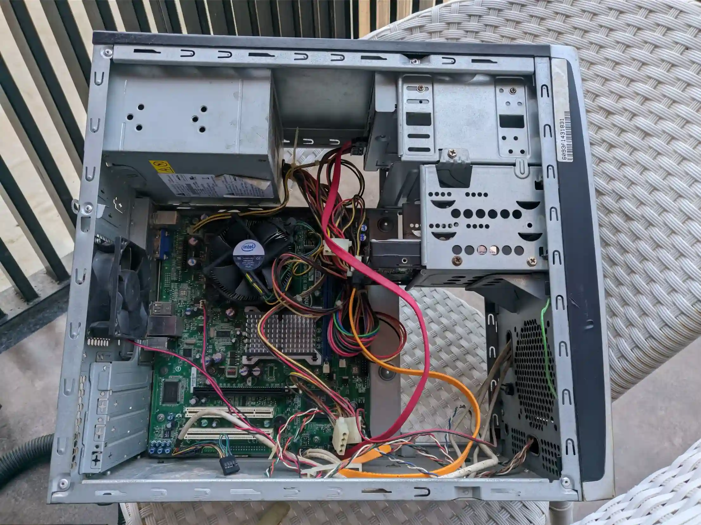
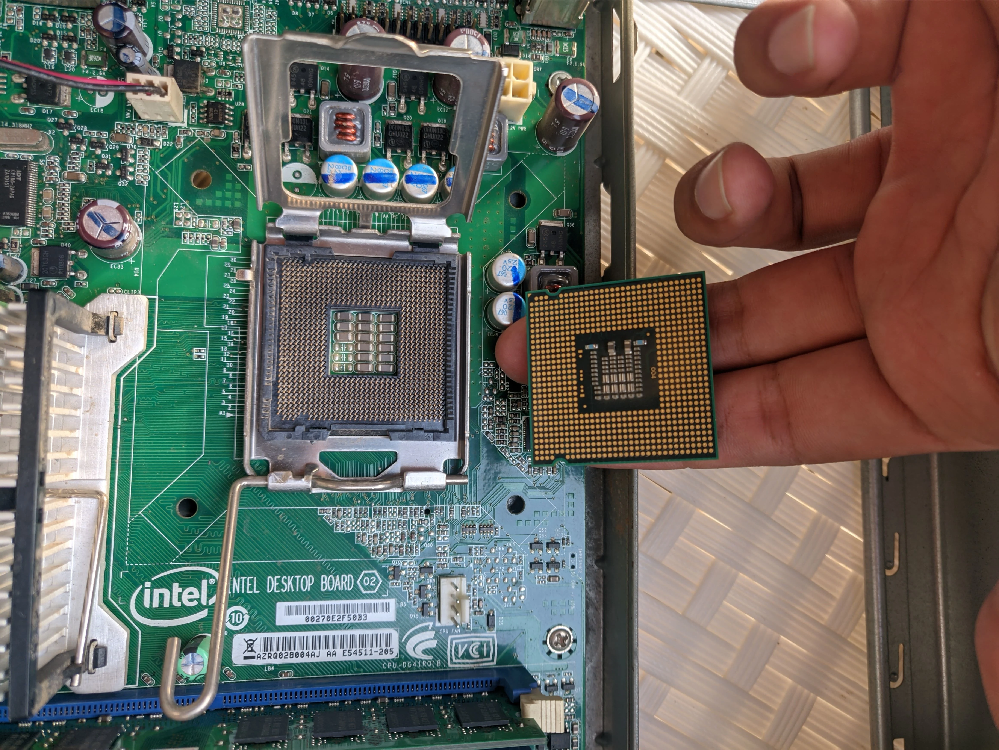
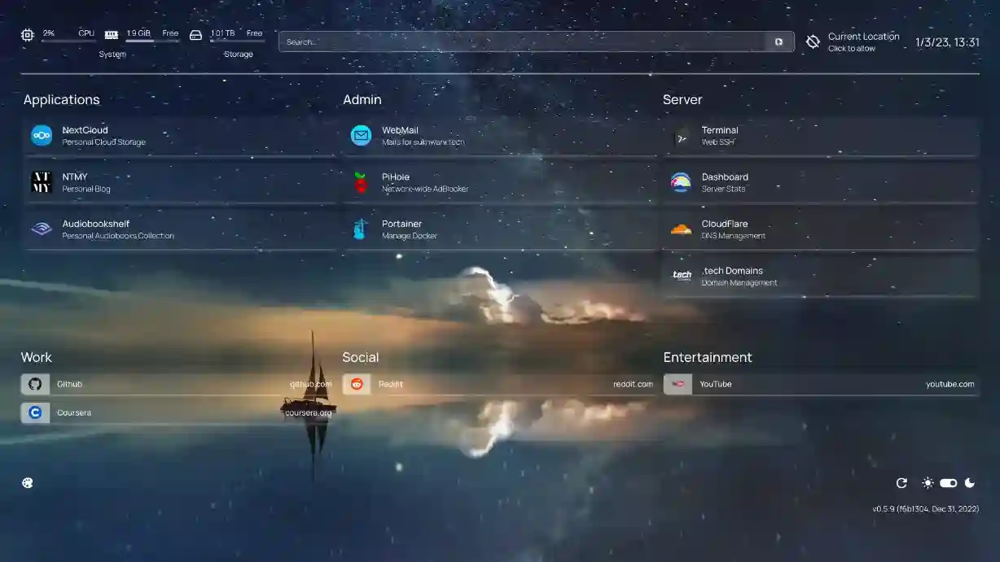

# Selfhosting Setup

## Own your data

**Mitanshu Sukhwani** • _09 June 2025_

Anyone saw this documentary called [Social Dillema (2020)](https://www.imdb.com/title/tt11464826/)?

> Tech experts from Silicon Valley sound the alarm on the dangerous impact of social networking, which Big Tech use in an attempt to manipulate and influence.

Well I did and got a little overboard with my emotions. The movie showed how so many of the little things apps do to make you stay hooked. My first response was to just delete all my social media. However, sometimes it gets lonely and with time your friends prod you to join a certain platform. I gave in after a bit, but always had a longing feeling to not use it. So after my Master's ended, and while I was on a break, I tried to figure out selfhosting.

Self-hosting is the practice of hosting and managing applications on your own server(s) instead of consuming from [SaaSS](https://www.gnu.org/philosophy/who-does-that-server-really-serve.html) providers. And good for me, I had an old cpu lying around to mess with to my hearts desire.

The specs are underwhelming. It had 2GB of DDR2 RAM, [Core 2 Duo](https://en.wikipedia.org/wiki/Intel_Core_2) E7500, and an external 1TB HDD.

It was a dusty old thing, so I took it apart and cleaned it. When I reassembled it, it would not start up! Turns out, little blue lego (short-circuit pin) are important and should not be discarded.

It used an [LGA 755](https://en.wikipedia.org/wiki/LGA_775) socket.

I installed [Debian](https://www.debian.org/) on it. Learned about [Docker](https://www.docker.com/) as a way to run software with the least amount of headaches.

My personal favorite is [Nextcloud](https://nextcloud.com/) (Google Drive alternative), [Audiobookshelf](https://www.audiobookshelf.org/) (Audible alternative). I would host these sites on the Internet using [Cloudflare Tunnel](https://developers.cloudflare.com/cloudflare-one/connections/connect-networks/). My VPN of choice is [Tailscale](https://tailscale.com/) to connect to your devices without having setup a server for VPN specifically.

Numerous Youtube [videos](https://www.youtube.com/@NovaspiritTech) and stackoverflow [posts](https://serverfault.com/) have helped me troubleshoot tiniest of my problems. Many thanks to these wonderful people for existing.

Find the software you want on [awesome-selfhosted/awesome-selfhosted](https://github.com/awesome-selfhosted/awesome-selfhosted).

# Bonus

Get a [class 1.111b](https://aydacfu.xyz/downloads/1111B_WhitePaper_retro.pdf?v=2) top level domain name for less than a dollar on [NameCheap](https://www.namecheap.com/) and use it with [Cloudflare](https://www.cloudflare.com/).
