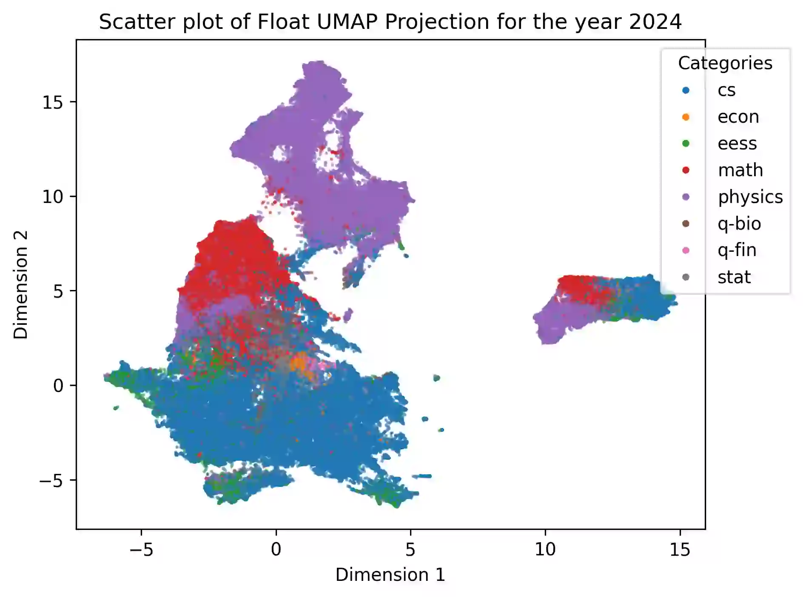
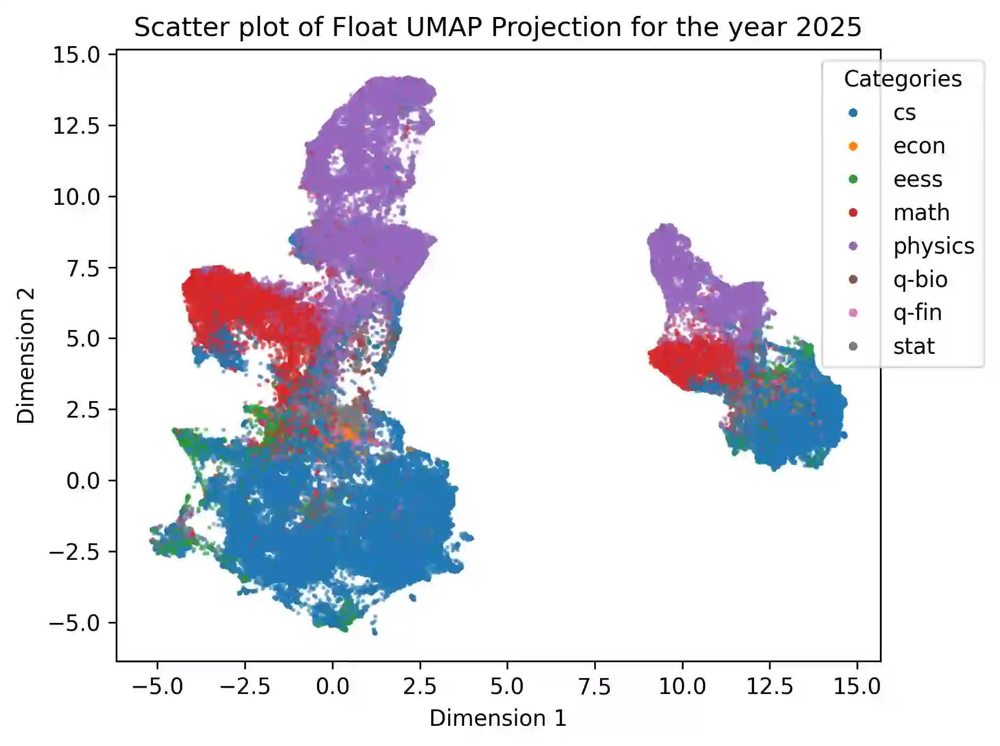
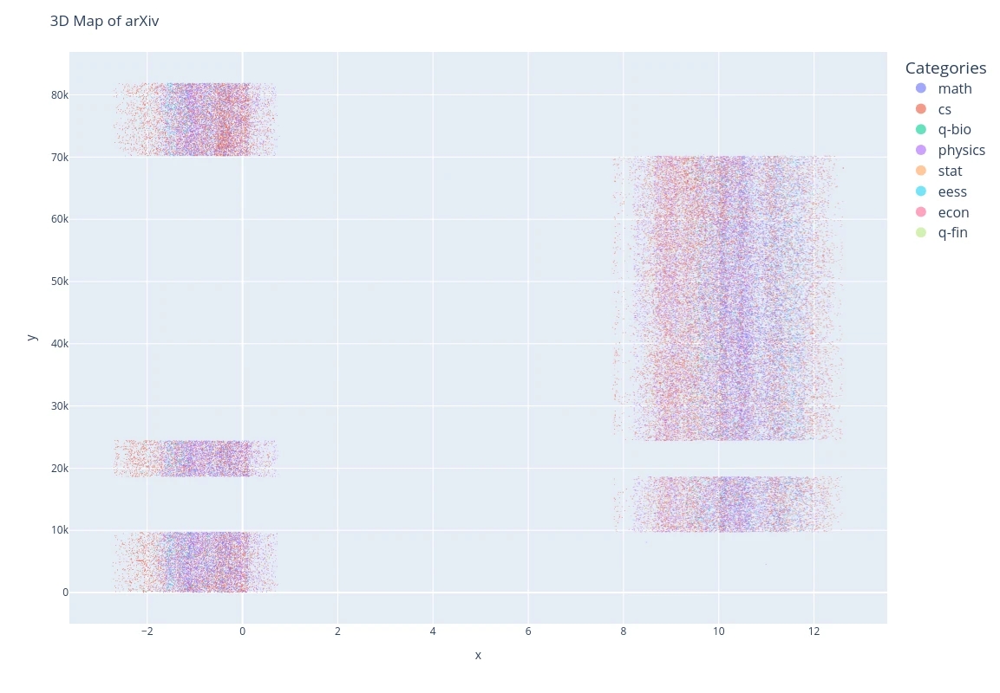
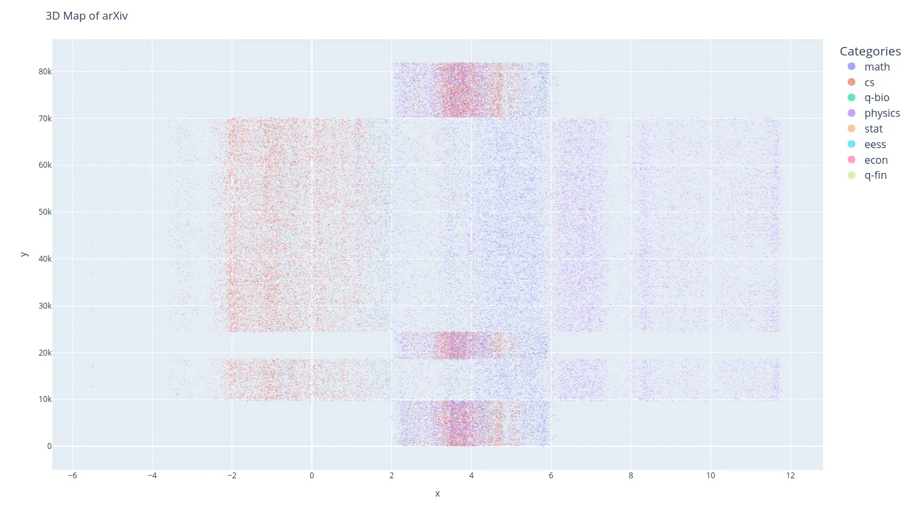
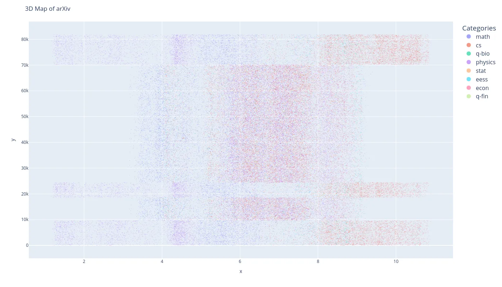

---
# 1. Basic Identification
title: "What about the Island?"
subtitle: "**Did aliens try to divert the direction of arxiv?**"
author: "_Mitanshu Sukhwani_"
date: "`2025-06-13`"
lang: en
mainfont: 'Helvetica'

# 2. Metadata / SEO
description: "A mysterious cluster of arXiv papers formed a new 'island' in UMAP projections between Nov 2024–Feb 2025. Data suggests a systemic shift—was it aliens or just arXiv changing something?"
keywords: "arXiv, UMAP, dimensionality reduction, PaperMatch, academia evolution, arXiv island, alien theory, data analysis"
---

In the previous blog post, [**PaperMatch Analysis**](PaperMatch_Analysis.html), we saw how when we analyse the embedding vectors from arXiv abstracts and use dimensionality reduction techniques, we can effectively map out how academia has evolved, at least in the eyes of arXiv. There was even a [**3D map of arXiv**](../image/arxiv_3d_map_all_years.html) to play around with and discover papers visually.

One interesting feature that was talked about was an "**island**" popping up. Technically, now we have 2 disjoint islands without a lone swimmer in sight. This was only seen in UMAP (& PCA) projections for the year $2024$ and $2025$, and never before!

However, I had presented PaperMatch at [CASML 2024](https://casml.cc/) in December. My analysis was cut-off at October 2024, where I shown a map of arXiv for the year 2024.

My part time friend [Kshitij](https://scholar.google.com/citations?user=ZoH8YT4AAAAJ&hl=en&oi=sra), and a full time physics lover, noted that this means that the new island has to have appeared in the months after. Digging into this hypothesis revealed something deeper. All the papers in the new island were from November 2024 to February 2024.

So we projected the first dimension from UMAP, which is supposed to carry the most information, to notice the trends.

Next is the second most (y)

and third most (z) 1D plots of the same.

_Click on the images to go to an interactive version of it._

X-Axis has the value of 'x', the first dimension of UMAP. Y-Axis is simply `range(df.shape[0])`. The thing to notice is, when you move upwards you also happen to travel in time. The papers near the x-axis are early november and their [arXiv ID](https://info.arxiv.org/help/arxiv_identifier.html) increase linearly without fail. Now do you want to guess which patch is the island?

Click to reveal.
It's the right one!

Since we are going up in time, and we notice that the new island only occurs between November to February, it has to be the discountinous patch in between. The dates for the 4 distinct patches (leaving the start and end since that continue on) are:

- _14th November 2024_
- _27th November 2024_
- _5th December 2024_
- _12th February 2025_

As noticed, the gap muddles a bit as you go into higher dimensions but the distinct lines remain!

Kshitij's leading theory was aliens controlling all of humanity to publish differently for a bit, then not, and then on and off again. But just before making this blog live, he changed it to arXiv changing something to the way they collect abstracts.

**What are your thoughts on this?**
